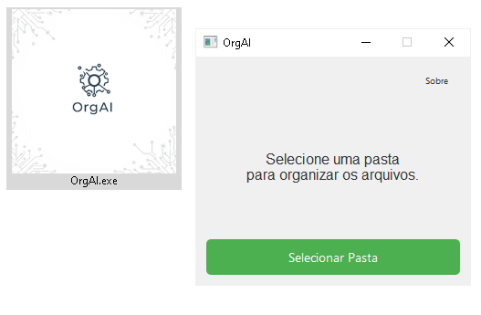

<!-- filepath: /c:/Users/Pichau/Desktop/organize.AI/README.md -->
# OrgAI


> https://jetrom17.github.io/OrgAI/

## Descrição

OrgAI é um aplicativo que organiza os arquivos de uma pasta com base na extensão dos mesmos. Se você tem vários arquivos na pasta de Downloads, experimente usar este programa para organizar cada arquivo para dentro de sua pasta corresponde ao tipo de arquivo.

## Requisitos

- Python 3.11 ou superior  
- As dependências estão listadas no arquivo [requirements.txt](./requirements.txt)

## Instalação

1. Clone o repositório ou baixe os arquivos.
2. (Opcional) Crie e ative um ambiente virtual:
   ```bash
   # Windows 10/11
   python -m venv venv
   venv\Scripts\activate
   pip install -r requirements.txt
   python OrgAI.py
   pyinstaller --onefile --windowed --icon=logo.ico --add-data "logo.ico;." orgai.py
   ```