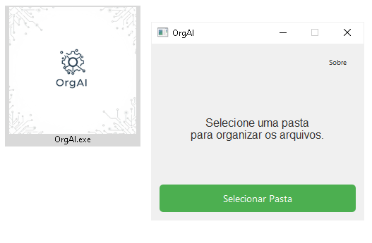

# OrgAI



Aplicativo desktop em PyQt6 para organizar arquivos por extensao, com assistente de IA local para analise de destino antes da movimentacao.

## Novidades da versao 2.0

- Interface moderna inspirada em componentes Bootstrap.
- Correcao de icone no app (janela + barra do Windows + build).
- IA local para sugerir e explicar a organizacao por extensao.
- Tratamento de erros simplificado para usuarios leigos.
- Remocao de trechos redundantes no codigo e na pagina de download.

## Requisitos

- Python 3.11+
- Dependencias em `requirements.txt`

## Execucao local

```bash
pip install -r requirements.txt
python OrgAI.py
```

## Build com PyInstaller

```bash
pyinstaller --onefile --windowed --icon=logo.ico --add-data "logo.ico;." --add-data "image.png;." OrgAI.py
```

## Instalador (Inno Setup)

1. Gere o executavel em `dist/OrgAI.exe`.
2. Compile `OrgAI.iss` no Inno Setup.
